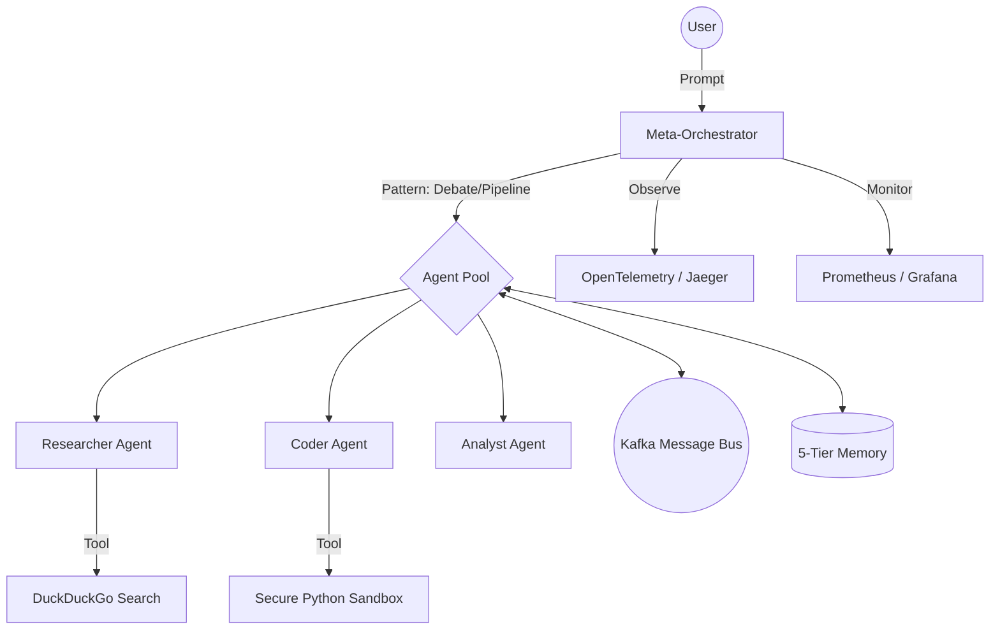

# 🚀 Advanced Multi-Agent Swarm Framework

A production-grade, enterprise-ready multi-agent orchestration system designed for high-stakes autonomous tasks. This framework moves beyond simple LLM calls into a robust, self-healing swarm architecture featuring hierarchical orchestration, multi-layered memory, and secure code execution.

---

## 🌟 Core Features

### 🧠 5-Tier Memory Architecture
Our agents don't just "chat"; they have a deep, persistent memory system:
- **L1 (Working)**: Short-term contextual buffer (Python deques).
- **L2 (Session)**: Redis-backed state for real-time consistency.
- **L3 (Episodic)**: Persistent local history via SQLite (FTS5 enabled).
- **L4 (Semantic)**: Long-term vector storage using ChromaDB for RAG-based recall.
- **L5 (Relational)**: Conceptual knowledge mapping via NetworkX.

### 🛡️ Secure Execution & Safety
- **Python Sandbox**: Agents execute code in an isolated subprocess environment with timeouts, protecting your host system.
- **HITL (Human-in-the-Loop)**: Orchestrator halts and requests human approval for "CRITICAL" tasks or sensitive pipeline steps.

### 🔌 Intelligent Routing & Efficiency
- **Provider Router**: Automatically handles fallback, circuit breaking, and load balancing across OpenAI, Gemini, Groq, and more.
- **Semantic Caching**: Redis-backed caching intercepts duplicate queries, reducing token costs by up to 80% and latency by 90%.

### 🌍 Real-Time Capabilities
- **Live Search**: Researcher agents use DuckDuckGo to fetch live internet data during debates.
- **Async Communication**: Built on a Kafka message bus, allowing agents to work asynchronously and scale horizontally.

---

## 🏗️ Architecture



---

## 🚀 Quick Start

### 1. Prerequisites
Ensure you have **Docker** and **Python 3.11+** installed.

### 2. Setup Environment
```bash
git clone https://github.com/Aj2280/advanced-multi-agent.git
cd advanced-multi-agent
python -m venv .venv
source .venv/bin/activate
pip install -e ".[dev]"
```

### 3. Start Infrastructure
```bash
docker compose -f infra/docker-compose.yml up -d
```

### 4. Run the Swarm
**CLI Mode:**
```bash
python -m main --mode swarm --agents researcher,coder,analyst --pattern debate "Research the current price of Bitcoin and write a report."
```

**Web UI Mode:**
```bash
streamlit run chat_ui.py
```

### 5. Connection refused in the browser?

`ERR_CONNECTION_REFUSED` means **nothing is listening** on that URL (wrong machine, process not started, or different port).

From the repo root:

```bash
python scripts/workbench_doctor.py
```

It checks common LLM env vars, whether **5173** (Vite) and **8800** (optional Workbench API, if present in your tree) accept TCP, and **`GET /health`** when the API answers. Follow the printed “Fix:” lines (usually `cd frontend && npm run dev`).

---

## 📊 Observability
Track every agent's "thought process" and system performance:
- **Jaeger (Traces)**: `http://localhost:16686`
- **Prometheus (Metrics)**: `http://localhost:9090`
- **Grafana (Dashboards)**: `http://localhost:3000`

---

## 🛠️ Configuration
All agent behaviors and model routings are defined in:
- `config/agents.yaml`: Define personas, instructions, and tools.
- `config/models.yaml`: Manage model selection and priorities.

---

## 🤝 Contributing
Contributions are welcome! Please see the issues tracker for active goals including Knowledge Graph expansion and Playwright tool integration.

License: MIT
